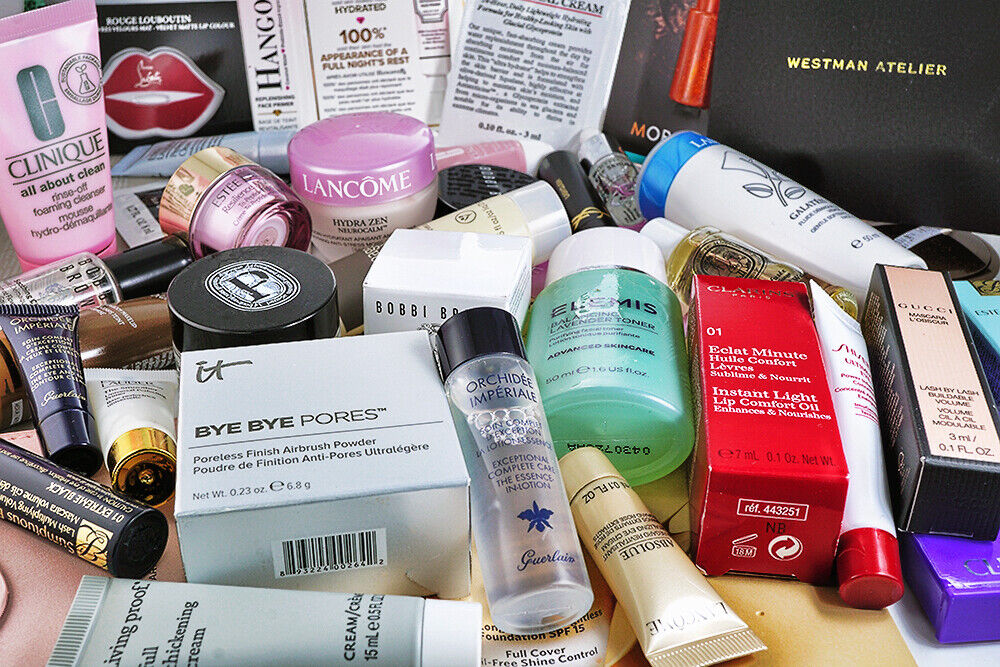

```{r setup, include=FALSE}
knitr::opts_chunk$set(echo = TRUE)

library(httr)
library(rvest)
library(jsonlite)
library(tidyverse)
library(reticulate)
library(dplyr)
library(stringr)
library(readxl)
library(ggplot2)
library(RColorBrewer)


```

# Curated Sephora Skincare Generator 3000000

## Content Based Filtering Recommendation System

------------------------------------------------------------------------

# Introduction

With the growing number of skincare products available, choosing the right one for an individual’s specific needs can be overwhelming. To help users navigate this vast selection, we developed a content-based skincare recommendation system that suggests products based on their attributes and similarity to other items.

We wanted to build something that would save users money and time from trying product after product, since everyone's skin is different! Advertising and reviews are misleading since company goals don't align with the user's best interest: finding the right skincare! Our model not only selects products based on similarity, but also incorporates ingredient lists, skin types, and targeted skin concerns. This filtering gives users 10 individually catered products to their specific needs. For user accessibility we chose Sephora's Skincare selection.

{width="402"}{width="217"}

### Web-scraped Data Description

To build our skincare recommendation system, we collected product data from the Sephora website using web scraping techniques. After checking for permissions, we used the robots.txt file to acquire an html of [product links](https://www.sephora.com/sitemaps/products-sitemap_en-CA.xml), utilizing Selenium's Webdriver and Beautiful Soup. Filtering cosmetics and hair products left us with a categorized link data frame to begin web-scraping!

We encountered several obstacles but through trial and error extracted our information; pop-up ads, scroll-down functionality, custom user-agent strings to avoid bot detection. Scraping itself took copious amounts of time, and we found that smaller segments extracted less N/A's. Altogether we scraped **1,800 links** which filtered out to **500 observations and 12 columns.**

```{r, echo = FALSE}
# Webscraper_skincare.Rmd for full code

filtered_sephora <- read_excel("data/filtered_sephora.xlsx")

dim(filtered_sephora)
glimpse(filtered_sephora)
```

The data set contains key attributes essential for content-based filtering, including:

-   **Product Name**: The name of the skincare product.
-   **Brand**: The company or brand that manufactures the product.
-   **Category**: The type of product: exfoliates, cleansers, toners, serums, moisturizer, masks).
-   **Price**: The cost of the product in USD.
-   **Reviews**: The number of user reviews for the product.
-   **Size**: The quantity of the product (e.g., 100ml, 1.7oz).
-   **Ingredients**: A list of active and inactive ingredients.
-   **Description**: A textual summary of the product, often provided by the brand or Sephora.
-   **Skin Concern**: The specific skin issues the product addresses (e.g., acne, dryness, hyper-pigmentation).
-   **Skin Type**: The recommended skin types for the product (e.g., oily, dry, combination).

------------------------------------------------------------------------

# Methodology

## Data Pre-processing

After collecting the raw data, we performed several pre-processing steps:

1.  **Cleaning the Data**: Removed duplicate entries and handled missing values through imputation or deletion.

```{r, echo = FALSE}
# EDA_skincare.Rmd

Christina0_600 <- read_excel("~/Desktop/Skin_Care_Recommendation/data/final_scraped_1200/Christina0-600.xlsx")
fifi601_1200 <- read_excel("~/Desktop/Skin_Care_Recommendation/data/final_scraped_1200/fifi601_1200_.xlsx")
scraped_sephora <- bind_rows(Christina0_600, fifi601_1200)

filter <- scraped_sephora  %>% 
  filter(!(`Skin Type` =="N/A" |`Skin Concerns` == "N/A" | `Product Rating` == "N/A"))

sum(is.na(filter))
```

2.  **Feature Engineering**: Formatted price, rating, and size for consistency.

```{r, warning = FALSE, echo = FALSE}
filter <- filter %>% 
  mutate(across(`Product Price`, ~ as.numeric(gsub("\\$", "", .)))) %>%  # take $ out of price
  mutate(
    `Product Price` = as.numeric(`Product Price`),      # Ensure numeric conversions
    `Product Rating` = round(as.numeric(`Product Rating`), 1), 
    `Product Reviews` = as.numeric(`Product Reviews`)) %>% 
  mutate(`Product Size` = case_when( 
      `Product Size` == "N/A" ~ "No Size", 
      TRUE ~ `Product Size`      # change N/A to No size
    ) )

filter %>% 
  head()
```

## Recommendation System: Content-Based Filtering

Our system uses **content-based filtering**, a recommendation approach that suggests products based on their attributes rather than user interactions. We opted for this approach to respect the privacy of Sephora's customers and for user accessibility.

### **What is Content-Based Filtering?**

Content-based filtering analyzes the characteristics of items to recommend similar products. Instead of relying on user behavior (as in collaborative filtering), it compares the features of a given product to those of other products in the data set.

In our case, we represent each skincare product as a **feature vector**, incorporating product descriptions, ingredients, category, skin concerns, and other relevant attributes. The similarity between products is calculated using **cosine similarity**, which measures the angle between two vectors in a multi-dimensional space. A higher cosine similarity score indicates that two products are more alike.

Mathematically, cosine similarity between two product vectors **A** and **B** is given by:

$$
S_C(A, B) = \cos(\theta) = \frac{A \cdot B}{\|A\| \|B\|}
$$

Where: - $A \cdot B$ is the dot product of the two vectors, - $\|A\|$ and $\|B\|$ are the magnitudes of the vectors.

Using this approach, when a user selects a product, the system finds other products with the highest cosine similarity, ensuring recommendations are tailored to the product’s attributes!

## Implementation

We implemented the recommendation system in **Python**, using `scikit-learn` for text vectorization and similarity computations. The key steps include:

1.  **Text Vectorization**: We converted textual data (e.g., ingredients, descriptions) into vectors using **TF-IDF (Term Frequency-Inverse Document Frequency)**.

```{python}
import pandas as pd
import numpy as np
from sklearn.feature_extraction.text import TfidfVectorizer
import openpyxl
import string

df = pd.read_excel("/Users/fifi/Desktop/Skin_Care_Recommendation/data/filtered_sephora.xlsx")
df

df_recommend2 = df[["Brand Name", "Product Name", "Product Category", "Product Description", 
                    "Product Ingredients", "Skin Type", "Skin Concerns"]]
df_recommend2_cols = ["Brand Name", "Product Name", "Product Category", "Product Description", 
                    "Product Ingredients", "Skin Type", "Skin Concerns"]
df_recommend2.columns = df_recommend2_cols
# Select columns
# concatenate all the strings and then fit it into TfidfVectorizer

df_recommend2['Product Description'] = df_recommend2['Product Description'].fillna(value = "No Description")
df_recommend2

df_recommend2[df_recommend2['Product Description'].isna()] # final N/A fix
```

```{python}
import string
from sklearn.metrics.pairwise import cosine_similarity

# function to remove punctuation from columns
def remove_punctuation(value):
    return value.translate(str.maketrans('', '', string.punctuation))
  
# df_recommend2 = df_recommend2.astype(str) # make each column a string
df_recommend2['string'] = df_recommend2['Brand Name'].map(remove_punctuation) + " " + \
df_recommend2['Product Name'].map(remove_punctuation) + " " + \
df_recommend2['Product Category'].map(remove_punctuation) + " " + \
df_recommend2['Product Description'].map(remove_punctuation) + " " + \
df_recommend2['Product Ingredients'].map(remove_punctuation) + " " + \
df_recommend2['Skin Type'].map(remove_punctuation) + " " + \
df_recommend2['Skin Concerns'].map(remove_punctuation)

tfidf = TfidfVectorizer()
tfidf_matrix = tfidf.fit_transform(df_recommend2['string']) 
```

2.  **Similarity Calculation**: We computed pairwise cosine similarity scores between products.

```{python}

cosine_similarity = cosine_similarity(tfidf_matrix)

similarity_df = pd.DataFrame(cosine_similarity, index = df_recommend2['Product Name'], columns = df_recommend2['Product Name'])

similarity_df.head()
```

3.  **Recommendation Generation**: For a given product, the system returns the top **10** most similar products based on similarity scores.

```{python}
df_index = pd.Series(df_recommend2.index, index = df_recommend2['Product Name'])
def give_recommendation(product_name):
    product_index = similarity_df.index.get_loc(product_name)
    top_10 = similarity_df.iloc[product_index].sort_values(ascending=False)[1:11]
    
    print(f"Skin Care Recommendations for customers buying {product_name} :\n")
    print(top_10)
    
give_recommendation("Vinoclean Gentle Cleansing Almond Milk")
```

------------------------------------------------------------------------

# EDA Visuals

To better understand the composition and characteristics of the skincare product dataset, we visualized key variables such as product category, rating, price, and number of reviews.

### Distribution of Product Category

We begin by examining how the products are distributed across different categories. This helps us identify which types of skincare products are most represented in the dataset.

```{r, echo = FALSE}

filter %>%
  group_by(`Product Category`) %>%
  summarise(Product_Type = n()) %>%
  ggplot(aes(x = reorder(`Product Category`, -Product_Type), y = Product_Type, fill = `Product Category`)) +
  geom_col() +
  labs(
    title = "Distribution of Product Types",
    x = "Product Category",
    y = "Number of Products"
  ) +
  theme_minimal() +
  scale_fill_brewer(palette = "Set2") + 
  coord_flip() +  
  theme(plot.title = element_text(hjust = 0.5))

```

From the chart, we see that certain categories like creams and cleansers are more common over toners and serums.

### Plot Product Rating and Reviews

Next, we want to look at how product ratings are distributed to understand how satisfied customers are with the available skincare products.

```{r, warning = FALSE, echo = FALSE}
# Plot distribution of Product Rating
ggplot(filter, aes(x = `Product Rating`)) +
  geom_histogram(bins = 30, fill = "darkseagreen", alpha = 0.7, color = "black") +
  geom_density(aes(y = ..density.. * 30), color = "deeppink3", size = 1) +  # Overlay density
  labs(title = "Distribution of Product Ratings", x = "Rating", y = "Count") +
  theme_minimal() +
  theme(plot.title = element_text(hjust = 0.5))
```

The majority of products have ratings of 4.5, indicating generally positive customer experiences. There's a visible right-skewed distribution, with very few products receiving low ratings.

### Distribution of Product Reviews

We also want to see how many customer reviews each product recieved. Since review counts can vary widely, we use a logarithmic scale to better represent the spread.

```{r, warning = FALSE, echo = FALSE}

# Plot distribution of Product Reviews (log scale to handle large variations)
ggplot(filter, aes(x = `Product Reviews`)) +
  geom_histogram(bins = 30, fill = "darkseagreen", alpha = 0.7, color = "black") +
  scale_x_log10() +  # Log scale for better visualization
  labs(title = "Distribution of Product Reviews", x = "Number of Reviews (log10)", y = "Count") +
  theme_minimal() +
  theme(plot.title = element_text(hjust = 0.4))
```

This plot reveals that while most products have fewer than 100 reviews, a small number of popular products have received thousands of reviews, making them more influential in the recommendation system.

### Top 10 Most Reviews Skincare Products

To identify the most popular products in our dataset, we plotted the top 10 skincare items based on the number of user reviews. In addition to showing popularity, we added each product’s average rating as a label to reveal how well these bestsellers are actually received by customers.

```{r, echo = FALSE}
# CANT KNIT W STAR EMOJI
filter %>%
  arrange(desc(`Product Reviews`)) %>%
  slice(1:10) %>%
  ggplot(aes(x = reorder(`Product Name`, `Product Reviews`), y = `Product Reviews`)) +
  geom_col(fill = "skyblue3") +
  geom_text(aes(label = paste0("", round(`Product Rating`, 1))),
            hjust = -0.1, size = 3.5, color = "black") +
  labs(title = "Top 10 Most Reviewed Skincare Products (with Ratings)",
       x = "Product Name",
       y = "Number of Reviews") +
  coord_flip() +
  theme_minimal() +
  theme(plot.title = element_text(hjust = 3)) +
  ylim(0, max(filter$`Product Reviews`, na.rm = TRUE) * 1.15)

```

We see a wide range of review counts, with all of these products exceeding 5000+ reviews, indicating high visibility and strong customer engagement. Interestingly, not all of the most reviewed products have the highest ratings, highlighting that popularity doesn’t always guarantee satisfaction. For example, some top-reviewed products hover around a 4.2–4.4 rating, while others stand out with ratings closer to 4.8 or above.

**rubric:** describes the results of the project in **3 to 5 paragraphs** with **at least 4 different plots or tables**.

If you choose to use an API or build a web scraper, you should then also conduct some EDA (exploratory data analysis) or fit some supervised learning model(s).

------------------------------------------------------------------------

# Conclusion
